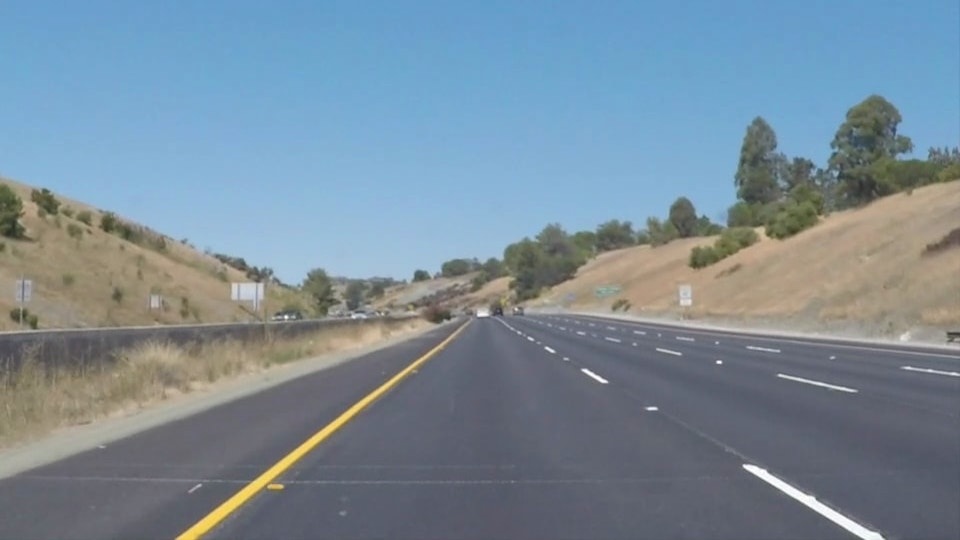
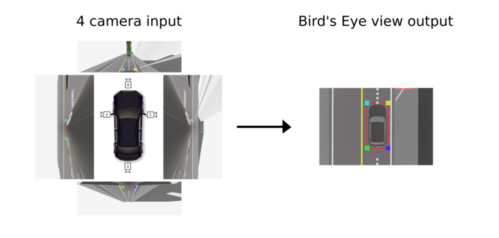
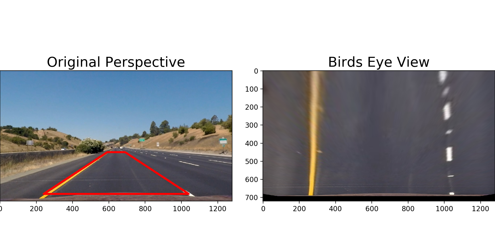
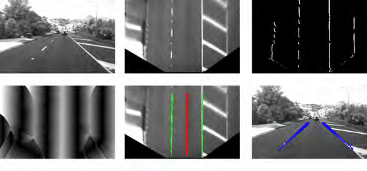

# OpenCV - Automobile
Raspberry Pi를 하드웨어의 기반으로 둔, openCV & Python 자율 주행 프로젝트 였으나 프로젝트가 무산되어서 어쩔수 없이 자율자동차의 관련 프로젝트의 래퍼런스 처럼 사용되고 있다.

# What is that?
일단 이게 원래 시연회를 위해서 쓰인 프로젝트 였으나 이게 어쩌저찌 하다가 터졌다. 자율주행에 대한 자료와 코드를 긁어 오기 위해서 진행한 프로젝트 였다. 개인 시연회 진행 예정 이였으나 아마 이게 생각보다 안 잡히는 문제도 많고 실질적인 맵 만들기를 혼자서 진행하기 어려워서 였나 암튼 여러 이유로 취소 되었다.

현재는 시연 이외에 개인 프로젝트 혹은 보고서 등 다른데에서 필요로 사용할 때 많이 사용을 하고 있다.

# 코드 설명
## perspective.py
```
openCV-automobile/perspective.py
```
perspective.py 같은 경우는 실질적으로 가장 많이 테스트를 진행한 코드로 기억을 하며 가장 결과물을 깔끔하게 배출하는 코드 이다. Perspective Transform을 통해 나온 결과 값을 통하여 lane 확인과 방향 등 프로세싱을 진행한다. 

## perspective_Image.py
```
openCV-automobile/perspective_Image.py
```
perspective_Image.py 는 말 그대로 image 파일을 읽어와서 테스트를 진행한다. 사진에서의 lane을 따온다고 생각을 하면 쉽다.

## perspective_Video.py
사실상 perspective.py와 같은 프로그램 이였으나 아마 기억상으로는 테스트 용으로 썻던 코드로 기억한다.

> 뭐 이건 당연한 얘기지만...
 <a href="https://docs.opencv.org/3.4/d8/dfe/classcv_1_1VideoCapture.html">cv2.VideoCapture()</a> 에서 값을 0으로 넣어주게 되면 실시간 처리가 가능하다. <br> <br>

## ./openCV-automobile/line_images
안에 있는 line.py 는 테스트를 진행 할때 가장 빠르게 lane을 잡는 코드 이다. 내 기억상 real-time이 되었던거 같은데 lane은 잡지만 그에 대한 다른 액션을 취하진 못한다. 그닌까 왼쪽 오른쪽 구분을 할줄은 모른다 이런말이지.

# How it works?

위와 같은 사진 혹은 영상이 카메라에 입력이 된다고 하자. 입력이 된다는 의미는 뭐 찍힌다는 의미로 해석하면 쉽게 될거다. 아무튼 이 프로그램의 주 목적은 차선을 인식하고 경로를 안내하는 것이 주 목표이다. 그렇기에 차선을 빠르게 찾는게 중요하다.

그 전에 Bird-eye view 의 개념을 알고 있어야 하는데 Bird-eye view 는 말 그대로 __새 눈의 시점__ 라고 해석을 하면 된다. 즉 하늘에 있는 새가 땅에 있는 우리를 쳐다보면 정수리가 보이듯 __직각에서 보는 시점__ 을 말한다. 이런 기술이 어디에서 쓰일까 싶은데 지금 현존하는 대다수의 자동차에서 주차 모드를 키면 나오게 될때 Bird-eye View 를 활용하여 멋진 인터페이스를 제공해준다.


아무튼 이게 왜 쓰이냐? 위에 입력 사진을 그대로 보고 차선의 기울기를 계산하기에는 컴픂터에게는 어려운 점이 있다. 지금 입력 값만 보기에는 직선인지 곡선인지 판단하기가 어렵기 때문이다. 그렇기에 직각에서 내려다보게 왜곡을 시켜 기울기 값을 원활하게 구하는 것이다. 아래 사진이 그에 대한 설명과 예시이다.


우리는 저런식으로 왜곡을 해줌으로써 아래 차선의 기울기를 구할 수 있게 된 것이다.
간단히 말하면 사다리꼴을 직사각형으로 만들어준다고 생각하면 된다. 물론 왜곡이 되거나 휘어지면서 화질의 문제가 생기지만 목적만 달성하면 되니 크게 문제가 될게 없다. 

그리고 가장 중요한 것은 변환된 이미지를 그대로 사용하지 않고 바이너리 이미지로 변경을 해준다. 바이너리 즉, 2진수의 사진으로 변경을 해주기 때문에 선의 구분이 확실히 됨으로 크게 문제 될 것이 없다. 이게 이해가 안된다면 간단히 검정색 흰색으로 된 사진으로 생각하면 되는데 흑백 사진도 아니고 그냥 진짜 검정색과 흰색 밖에 없다.

위 사진에 우측 상단이 바로 Bird-eye view 로 변환한 사진을 2진수로 바꿔준 결과이다. 그러면 차선의 색이 뚜렷하게 보이기 때문에 더 빠르게 연산처리를 할 수 있게 된다. 그렇게 차선의 기울기를 해당 2진수 사진을 통해서 얻게 원본 영상에 적용을 해주면 최종적으로 프로그램의 목적에 달성하게 된다.

# Data
사진이랑 영상들은 직접 하나하나 뒤져가면서 찾은 것 들이다. 누군가에게는 이거라도 도움이 되길 바라며..
```bash
./openCV-automobile/videos
./openCV-automobile/images
```
